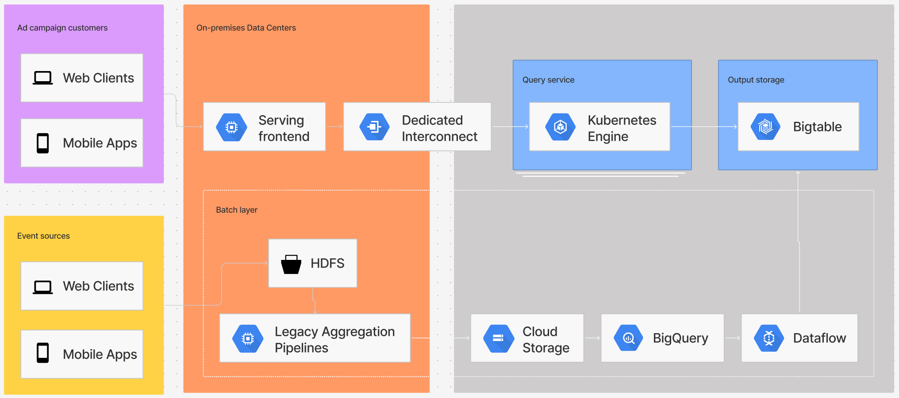

# FileBum: A Cloud Storage Solution for Real Estate Agents

**Overview**

FileBum is a cloud-based storage solution designed specifically for real estate agents. It simplifies the process of storing, sharing, and organizing crucial documents and media assets. By enforcing a structured, opinionated approach to document tagging, FileBum helps agents maintain a consistent and efficient workflow.

**Key Features**

### Cloud Storage

- **Secure Storage:** Reliably store your important real estate documents and media.
- **Flexible Sharing:** Easily share files with clients, colleagues, and partners.
- **Granular Permissions:** Control access to your files with customizable permissions.

### Document Search

- **Powerful Search:** Quickly find specific documents using keywords and filters.
- **Contextual Navigation:** Efficiently navigate through your document library.

### Client Interface (GUI)

- **Intuitive Design:** User-friendly interface for seamless interaction.
- **Agent Workflows:** Customizable workflows to streamline your daily tasks.
- **Admin Controls:** Advanced administrative features for managing users and permissions.

**Project Structure**

- **cloud_storage:**
  - API
  - CLI
- **doc_search:**
  - API
  - CLI
- **client_gui:**
  - macOS
  - Web
  - iOS
  - Windows
  - Android

**How it works**

**License**

[MIT]
